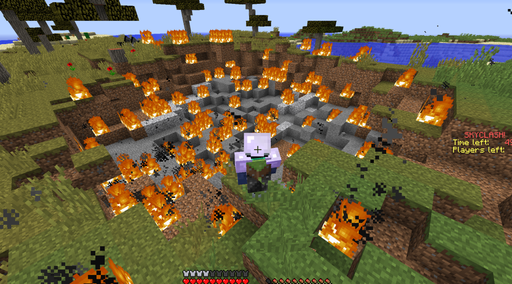

# Changelog
## v1.6.3
- test to check if auto updater works

## v1.6.2
- fixed new players files being null
- fixed starting at spawn when die
- fixed kill leaderboard - idk what the cause is
- fixed autoready not working for joining
- disabled jester using number keys to move items
- buffed guardian to have 2 30s absorption potions
- nerfed swordsman extra damage by 50% and 15->25s cooldown
- tried to fix grim reaper instant kill not working
- buffed grim reaper from 45-30s kills, and less health taken away, chat message to say how long is left
- nerfed beserker potion from absorption level 4->2
- nerfed lifesteal from 20% -> 10% health, added message to show how much was stolen

## v1.6.1
- Finished last bit of YML implementation
- changed chest generation, added enchantments to some items in mid chests
- put changelog in a seperate file
- simplified cooldown code

## v1.6.0
- changed mark on grim reaper to be 45 seconds
- no longer use /hub, or /end_game aliases
- Changed all plugin related files to be in plugins/SDPC folder
- automatically downloads lootchest file from the repo if not already present
- changed from JSONObject to gson, playerdata and mapdata formatted nicer
- removed lootpoint system, changed chest chances
- Changed the maps.json to be in the more readable .yml

TLDR; massive changes to file related code, as well as optimisations everywhere else

<blockquote> <i>Optimised README for faster reading</i> </blockquote>

## v1.5.4
- finished jester kit
- added grim reaper kit
- added custom items to the shop
- added no pearl cooldown to shop
- added resistance potion to shop
- moved every static variable where it should go, main.java is cleaner, and has all the credits
- plugin loads before worlds load as well as multiverse, fixed some bugs

Message of the day
- basically, if there is a file called motdList.txt in the plugins folder, it will take that and randomise a line from there to be the motd of the server

README
- finished readme and optimised it to be concise, informative and readable

## v1.5.3 
part 1
- Added jester kit as a proof of concept, only spades suit works
- Refactored lots of code to be private and non static
- Fixed many smaller bugs and patches
- Cards rent cost is now 10 and 16, as well as buy cost of 100 and 160, for lower and higher tier respectively

part 2
- Refactored more code
  - made playerStatus more clear
  - playerVote and mapVote systems are in one file

part 3
- Yippee refactoring!
  - Multiverse in 1 file to more easily change
  - Organised things better and reduced repeated code
- removed lootchest command

## v1.5.2
- Removed need for VoidWorld, now use SDPC
- Added a new command that allows map settings to be modified
  - ```/scworld [add | modify | list]```
  - use ```/scworld add <world name>``` to create a brand new void map with pre-configured settings
  - use ```/scworld modify <world name> <setting> <value>``` to change either the default lobby, icon, or visibility of a world
  - use ```/scworld list``` to show a list of worlds in skyclash settings, similar to `/mv list`

## v1.5.1
- Added item to let you teleport to already made maps
- Fixed card values showing wrong price in chat
- Fixed /leaderboard command

## v1.5.0
- no longer unloads maps when playing
- respawning fixed again
- added a worldborder
  - starts at 300 blocks wide
  - after the first chest refill will move until 20 blocks wide at the end of the game
- Added a toggle between not ready, ready, and autoready, as well as optimising the code for it
- Added the leaderboard command
  - Use `/leaderboard ? ` to view all stats, and `/leaderboard <stat>` to see the top ten players and your ranking
- optimised the menu code so its easier to follow
- fixed xEz Killz stat


### Cards now cost coins!
- Cards menu revamped to include a select mode and buy mode
- Select mode: select a card from top row, which costs 15 coins per game, or from next row which costs 22 per game
- Buy mode: Permanently buy a card so you don't have to pay for it again, which is 150 or 220 coins respectively
### New buff shop
- You can buy temporary buffs from here, that will effect your next game
- Currently only added the +1 golden apple item as a tester

## v1.4.3
- Fixed players being able to hit each other in lobby
- Fixed armour not clearing
- Added initial pearl cooldown of 15 seconds
- When use fireball only removes 1 item now
- Pearl cooldown now 2 seconds
- Fixed player deaths bug where the loot goes to mid
- Fixed autoready not working for /lobby | /hub as well as spectators
- All potions now have nicer formatting for effects
- Jump boots from slime blocks only effects jumpman now
- Players drop their items when they disconnect from a game
- Menu can only be accessed by right clicking
- Mid chest can only be opened by right clicking
- Revamped the Menu to include the (non functional) shop

Kits
- archer was actually 70% -> changed back to 30%
- homing arrow lifespan is 20 seconds and can only target people in game
- assassin pearl invis won't override any current invis
- berserker potion is 10 seconds and absorption 5
- Cleric potions are unstacked
- Guardian absorption potion 15s and get resistance 1 when below 5 hearts
- unstacked the water buckets for jumpman
- Jumpman winged boots do not override the jump potion now
- Winged boots are now only jump boost 3 -> 1
- Swordsman nerf:
  - Amount of potions 2 -> 1
  - Strength 2 -> 1
  - true damage every 10 seconds -> 15 seconds

Cards
- fixed monster hunter levels not working
- Apple finder chance to get golden apple from chest break 20 -> 40%
- Pacify reduces 20 -> 80% damage from "monsters"

## v1.4.2
- Fixed some minor bugs related to lifesteal at full health and disconnecting
- Fixed effects not clearing
- Saved enderchest so that it cannot be accessed ingame
- Fixed spectator mode not working when killed
- Capitalised "joins" stat
- Changed stats menu to display 0 instead of null
- Made kills only count if dead player was also ingame
- at the end of a game it automatically sets you ready

Kits and cards
- Buffed elven archer (3->5 seconds)
- Added the hit and run ability (lmao)
  - also made it 3 seconds speed on hit
- Assassin potions have a shorter duration
- Fixed necromancer + monster hunter
  - Made it cap at sharpness 3, then adds up to fire aspect 2
- Fixed cleric losing regeneration when eating gapple
- Nerfed archer to only 30% chance to home

## v1.4.1
- Added all the rest of the cards (~10 new cards)
  - blast protection -> now gets 2x fireballs
  - elven archer
  - quiver refill
  - apple finder
  - hit and run
  - pacify
  - pearl absorption
  - sugar rush
  - lifesteal
  - monster hunter
- jumpman now gets winged boots (gives jump boots on jump)
- necromancer now gets a jockey bow
- creeper card gets an explosive bow
- Fixed WR and KDR not having correct decimal places
- Changed game starting from 30s to 20s

## v1.4.0
- added 4 kits (master level):
  - jumpman: random chance to get slime in chest, slime blocks provide large vertical boost to anyone using it (might make specific to only this kit)
  - necromancer: summons a zombie on each kill
  - treasure hunter: gets a random drop from breaking a chest - golden apple, gold sword/axe, diamond, tnt
  - scout: gets speed from opening a chest
- readjusted all kits back to master level
- made mobs spawned not target the player who spawned it: affects creeper and necromancer
- add more lifetime stats
  - times died in first 30 seconds
  - deaths to the void
  - times killed xezkillz
- added item in menu to show lifetime stats, specially coded the KDR and WR to display the kills, deaths, wins and total game stats
- added kills leaderboard at end of each game
- added pearl cooldown of 5 seconds globally
- added lapis lazuli x6 to chest loot in spawn (40%)
- spawn immunity for 5 seconds (resistance 2)

## v1.3.2
Kits:
- Rebalanced all the kits to the doc mostly

Code:
- stuff
- added credits to top of readme

<i>What's even the point of numbering these updates, not like anyone ever looks here anyway unless i screwed up somewhere</i>

## v1.3.1
NEW SERVER ICON!


<br>

Code:
- You can now use `/chest | /chests` instead of /setchests
- NEW COMMAND: /chest scan `<radius> <add chest>`
  - You can find chests in an area and add them to the chest list more easily now
  - This can cause significant lag at very large radiuses
- Can use `/spawn | /spawns` instead of /gamespawn

## v1.3.0
Kits:
- changed all kits to be from level 0 now (basically nerfed everything, kept enchants tho)
- Added archer, 50% for their arrows to home on targets
- Added Cleric, healer build with higher passive regeneration
- Added Frost Knight, snowball hits on players give speed to them and slow down opponents
- Added Guardian, Gets resistance on low health
- Changed berserker to get regeneration instead of resistance on low health

4 more kits to go! (and a lot of cards :| )

Code:
- Fixed everything in the kitgenerator python script (except misinput for enchants), should work much better for generating all other kits and cards kind of

## v1.2.0
Kits:
- added swordsman true damage every 10 seconds 
- added berserker resistance on low health (2.5 hearts) passives
- made bigger bangs cause nearby explosions within 25 blocks have a greater explosion radius



- made bigger bangs spawn with flint and steel and 2 tnt

Code:
- fixed xp clearing
- fixed players being able to hit each other maybe
- added grace period of 5 seconds
- make setchest list show locations that have no chests
- added lifetime stats - kills, deaths, wins, games, join amount,

GitHub:
- accidentally spammed some commits
- added more to readme

## v1.1.3
Code:
- actually removed tags from players at start and end of game
- fixed players being able to hit each other in lobby
- fixed dc's
- fixed armour clearing
- fixed effect clearing
- fixed spectators dcing
- fixed startgame not working sometimes due to offline players being ready
- fixed /lobby for deopped players

Kits:
- swordsman strength level to 1 (from 2)
- assassin now gets 1 pearl and invis pot (from 2 each)
- berserker pots are 15 seconds (from 60)
- berserker pots are regen 2, resistance 1 (from 3, 2)

GitHub:
- Removed target cause its unnecessary
- somehow missed 1.1.2 oh well

## v1.1.2
Code:
- Made enderchests now spawn better loot
- Fixed minor inconveniences
- fixed nether star
- maybe fixed starting game issue
- there was once an block iterator issue

## v1.1.1
Code:
- made maps start with correct settings
- fixed /giveitem command and custom items not working
- changed /startgame to start in 5 seconds, as opposed to 30
- ingame map does not spawn mobs, set to day on start
- added /setchest [add|remove|list] command (can change where chest loot can go)
- added /gamespawn [add|remove|list] command (similar function but for spawnpoints instead)


## v1.1.0
GitHub:
- Added changelog
- changed plugin name to SDPC (skyclash drug pollinated code)
- Added todo in readme so it's easier to track progress

Code:
- refactored a lot of files and organised everything
- added chest refill system with chest loots
- Finished any loose ends with the plugin, it should be fully functional now
- Changed state value in json to hasJoined as it was no longer necessary