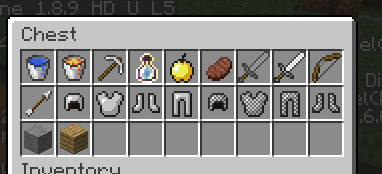

# Skyclash's Drug Pollinated Code


<strong>Reimagining Hypixel's minigame "Skyclash"</strong>

## Quick links
[Changelog](./CHANGELOG.md)

[Resources and Contributors](#resources-for-development)

## Installation
### Download
1) download the [latest version of the plugin](https://github.com/Elolisme/skyclash/tree/main/SDPC/target) 
2) Ensure you have [Multiverse Plugin](https://github.com/Multiverse/Multiverse-Core) installed in your server
3) Place the SDPC.jar file in the plugins folder, then restart the server and enjoy

### Configurations
- Use `/scworld add` to create a new map
  - Any current maps that are loaded in multiverse are automatically added
- Use `/scworld modify <world name> setLobby` to set a lobby
- use `/spawns add` in that world to set the spawnpoint
- Use `/lobby` to leleport to a lobby

## Commands
### All players
`/leaderboard <stat>`
- See the top ten people who have the highest of a stat
- Use `/leaderboard ?` to see the different stats that are available

`/lobby`
- send you to the first spawn point of the default world

### Only OP
`/abort`
- Ends the currently running game

`/chest [add|remove|list|scan] <radius> <add chests found>`
- lets you add/remove a chest in a world where loot will spawn, once a game starts on that world
- Takes the current chest you are looking at in a specific world
- This technically just edits maps.json, so you can manually input coords in the file
- /chest list will just list coords already set in the world

Example: Find chests in a 10 block radius around player and add them to maps.json
```
/chest scan 10 true
```

`/giveitem <player> <item>`
- lets you get custom items from this plugin

`/scworld [add | modify | list]`
- create a brand new map to play on, change settings of maps and the lobby, and show a list of worlds in skyclash
- for /scworld modify, current settings are:
  - setLobby 
    - sets the world to be the lobby spawn
    - to set the location in the world, use `/spawns add`
  - setIcon
    - changes the icon of the world to the material specified
  - isVisible
    - changes whether the map can be voted and played on, and is seen in the menu

`/setvotes <map index> <votes>`
- Used to change votes for a map for admins

`/startgame`
- Start the game earlier (5 seconds), may result in 0 player games where u need to /endgame

`/spawn [add|remove|list]`
- adds a spawnpoint for when games run, where players start out at
- look at block under spawn to set it as one, and use list to show already set coords
- this also modifies maps.json similarly to /setchest

## Permissions
sgm.lobby - default permission for everyone, allows /lobby, /leaderboard
<br>
sgm.host - allows opped players access to all other commands

## Kits and Cards
All the current kits and cards can be [found here.](https://docs.google.com/document/d/1uG-ECW3m7Ds7CggNtAK1Lahfh34M-sN9P6o0iTQjv0c/edit?usp=sharing)
<br>
This doc is always up to date with balancing, comment if you want a change to occur.

## Saving Data
When you log in, your data is saved to a file in `/Players/<username>.json`. Whenever the game needs it, it will read from those files

Also, SDPC will save all skyclash worlds to a JSON in `/plugins/maps.json` which has settings for each world, which automatically update for new worlds. Use the `/scworld` command to change settings.

### Chest Loot
The plugin will take chest loot from a folder called `/LootChests/..`, where loot tables is stored. There are a default of 2, one for spawn and one for mid.




- lapis lazuli has been added to spawn chests
- enchants are also added (hardcoded)

Note: This code was mostly taken [from this repo](https://github.com/Veraimt/CustomLootChest) but modified heavily.

### Lifetime Statistics
Use `/leaderboard ?` to see each stat, and `/leaderboard <stat>` to see your and the top 10 people with that stat.
The current statistics saved for each player are:
- Kills
- Deaths
- Wins
- Games
- Joins
- Coins
- Times died in first 30 seconds
- Deaths to the void
- Times killed xezkillz

## Voting for a map
Click into menu, then click on the block to vote for that map. For admins, use `/setvotes <map name> <value>` change the votes

## Starting the game
In the menu click the wool to become ready. When 2 or more people become ready the game will start automatically in 20s, and use autoready to stay ready even after leaving. Use `/startgame` to start the game faster.

## The Gameplay
Players spawn at preplaced spawnpoints on a copy of the most voted map, receiving their kit and card. objective is to be last person standing, by kill other players (gaining **10 coins** per kill). Go back to the lobby using ```/lobby or /hub```. Disconnecting is the same as dying. 

Chests will refill every 3 minutesm, 3 times in a game. When timer reaches 0, the game will instantly end with no winner. A worldborder of 300x300 across will start to shrink after the first chest refill into a 20x20.

When one player is left the game ends, and the survivor gains **50 coins**. The world is deleted after teleporting them and spectators back to the lobby. If you are in the lobby and a game is running, you can spectate the game through the menu.


## Custom Weapons
Get custom weapons by using `/giveitem <player> <item>`,  incorporated through certain kits. 
- chicken bow
- explosive bow
- winged boots
- fireball
- sword of justice (not used)

# Resources for development

### [All current Kits and Cards](https://docs.google.com/document/d/1uG-ECW3m7Ds7CggNtAK1Lahfh34M-sN9P6o0iTQjv0c/edit?usp=sharing)

### [Hypickle cards and maps](https://docs.google.com/document/d/14_MdE6IKqPPhNbR60T8SELjxTGKBIpSkJubV28Rsv2w/edit?usp=sharing)

### [Hypickle kits](https://docs.google.com/spreadsheets/d/19AjEcBofWj3tTlZCbzQlgGsIxJ_DaLLrYeETvVY76Nc/edit?usp=sharing)

### Server IP:
```
mc.elol.gay
```

## Contributers to Skyclash Remake
Developer + Server host
- TitanPlayz
- Elol

Builders
- CalibaniteKnight
- InfernoPig
- ElectricEel06
- TMaster9975
- GargariniteGulpur

Cool people
- xEzKillz_
- TROLLSTAR123
- 3Delusion
- DRPFan69
- iSilkySmooth
- zapic
- Chez_E

# TODO
- gamemode where killing makes you join their team