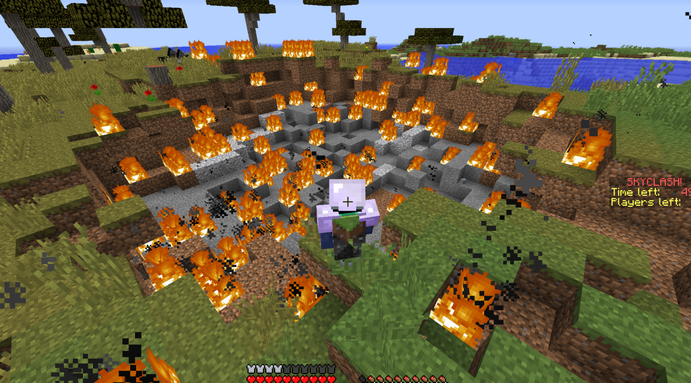

# Skyclash

<div align="center">
    
    <br>
    <br>
    <strong>Minecraft plugin, reimagining Hypixel's old minigame "Skyclash"</strong>
</div>

## Resources for development

### All current Kits and Cards
https://docs.google.com/document/d/1uG-ECW3m7Ds7CggNtAK1Lahfh34M-sN9P6o0iTQjv0c/edit?usp=sharing

### Hypickle cards and maps
https://docs.google.com/document/d/14_MdE6IKqPPhNbR60T8SELjxTGKBIpSkJubV28Rsv2w/edit?usp=sharing

### Hypickle kits
https://docs.google.com/spreadsheets/d/19AjEcBofWj3tTlZCbzQlgGsIxJ_DaLLrYeETvVY76Nc/edit?usp=sharing

### Chest locations
https://docs.google.com/spreadsheets/d/1B-bbUVI84wnbqoIyJHG1DLEuIvmKJaStwKW8BKYEctg/edit?usp=sharing

### Server IP
<strong>mc.elol.gay</strong>

## Contributers to Skyclash Remake
Developer
- TitanPlayz

Server host / Project Owner
- Elol

Builders
- CalibaniteKnight
- InfernoPig
- ElectricEel06
- TMaster9975
- GargariniteGulpur

Cool people
- xEzKillz_
- TROLLSTAR123
- 3Delusion
- DRPFan69
- iSilkySmooth
- zapic
- Chez_E

## How To Install
**TODO**

You need to install the multiverse plugin, this is dependant on that

You optionally would want VoidWorld plugin to generate new void worlds for new maps

### How to use multiverse:
```
/mv tp <ur username> <world name> 
    TP to a world use 
/mv list 
    See all the different worlds
/mv create <world name> normal -g VoidWorld 
    Create a new empty world
```


### Preferable settings for a new world:
- set the world ~ y=64 high up
- use /mv modify set monsters false to turn of mob spawns
- use /gamerule doDaylightCycle false,  and use /time set day
- use /mv modify set gamemode creative to set default to creative
- use /mv modify set spawn for spawn to be at ur location

## Skyclash's Drug Pollinated Code Plugin
### Commands
`/setvotes <map index> <votes>`
- Used to change votes for a map for admins

`/startgame`
- Start the game earlier (5 seconds), may result in 0 player games where u need to /endgame

`/giveitem <player> <item> | /customitem <player> <item>`
- lets you get custom items from this plugin

`/endgame | /abort`
- Ends the currently running game

`/lootchest <name>`
- makes a loot table file in `<root>/LootChests/..` from the current chest you are looking at

`/lobby | /hub`
- send you to the first spawn point of the default world

`/chest [add|remove|list|scan] <radius> <add chests found>` | /setchest
- lets you add/remove a chest in a world where loot will spawn, once a game starts on that world
- Takes the current chest you are looking at in a specific world
- This technically just edits maps.json, so you can manually input coords in the file
- /chest list will just list coords already set in the world
- Example: 
```
/chest scan 10 true
- Finds chests/enderchests in a 20x20x20 around player and adds them to maps.json
```

`/spawn [add|remove|list] | /gamespawn`
- adds a spawnpoint for when games run, where players start out at
- look at block under spawn to set it as one, and use list to show already set coords
- this also modifies maps.json similarly to /setchest

### Permissions
sgm.lobby - default permission for everyone, allows /lobby command
<br>
sgm.host - allows opped players access to all other commands

### Kits and Cards
Kits:
- Archer
- Assassin
- Beserker
- Cleric
- Frost Knight
- Guardian
- Jumpman
- Necromancer
- Swordsman
- Treasure hunter
- Scout

<i>Information for each kit can be found on <a href="https://docs.google.com/spreadsheets/d/19AjEcBofWj3tTlZCbzQlgGsIxJ_DaLLrYeETvVY76Nc/edit#gid=1239566438">this spreadsheet.</a> Some kits have also been rebalanced</i>

Cards:
- Bigger Bangs (just like ur mum)
- Creeper
- Damage Potion

### Saving Player, World
When you log in, your data is saved to a file in `<Root folder>/Players/<username>.json`
<br>
Whenever the game needs it, it will read from those files

Also, SDPC will save all multiverse worlds to a JSON in `<root>/plugins/maps.json` which has settings for each world, which automatically update for new worlds. You can manually edit any setting realtime.
<br>
You can change the icon of a world (icon:material), whether its a playable map (ignore:boolean), and where chests/spawnpoints are.

### Chest Loot
The plugin will take chest loot from a folder called `<root>/LootChests/..`, where loot tables is stored
<br>
There are a default of 2, one for spawn and one for mid. You can technically add more using /lootchest but you have to manually configure it in the plugin and recompile... It is much easier to just edit the current file.


<i>Note: lapis lazuli has been added to spawn chests</i>

This code was mostly taken <a href="https://github.com/Veraimt/CustomLootChest">from this repo </a>but modified heavily to integrate with SDPC

### Lifetime Statistics
The current statistics saved for each player are:
- Kills
- Deaths
- Wins
- Games
- Joins
- Times died in first 30 seconds
- Deaths to the void
- Times killed xezkillz

As well as storing coins, which are gained by killing (10) or winning a game (50)
* Note killing yourself will not award kill credit but counts as a death

### Voting System
Click into menu, then vote
<br>
Click on the block to vote for that map
<br>
When a game starts, if 2 maps have equal votes its a 50/50
```
/setvotes <map name> <value>
For admins, use this command to change the votes
```

Maps are automatically added for each **multiverse** world after the plugin is reloaded

### Starting the game
In the menu click the wool to become ready
<br>
When 2 or more people become ready the game starts in 30s
<br>
Click the wool again to unready yourself, this will cancel the game if 2 players are no longer ready.

```
/startgame
Exists for admins to start game manually
``` 

### The Gameplay
Players spawn at preplaced spawnpoints on the most voted map, receiving their kit and card. They must use loot from chests and enderchests to kill other players, gaining **10 coins** per kill. If you die you enter spectator mode and cannot participate further. You can go back to the lobby using ```/lobby or /hub```. Disconnecting from a game will be treated the same as losing, but items don't drop. 
<br>
Chests will refill every 3 minutes, or 180 seconds. This will happen 3 times in a game. When the timer reaches 0, the game will instantly end with no winner.
<br>
The game also ends once all but one player is left in battle, at which point they are awarded winner and gain **50 coins**, and the map is deleted after teleporting them and spectators back.
<br>
If you are in the hub and a game is running, you can spectate the game through the menu.

### Custom Weapons
Get weapons by using the command 
<br>
  ```  /giveitem <item>```
<br>
(use lowercase with spaces)
<br>
Example:
  ```
  /giveitem chicken bow
  ```

- Chicken bow
  - This shoots a chicken jockey instead of an arrow
  - Has 10 durability
- Explosive bow
  - Shoots tnt instead of arrows
  - Has 5 durability
- Winged boots
  - Wearing these leather boots gives you jump boost and less fall damage
- Fireball
  - Launch a fireball by clicking
  - Consumes item
- Sword of justice
  - Summon lightning 2 blocks in front of you when you hit an enemy
  - Has a cooldown of 2 seconds


# TODO
Soon
- add worldborder
- add a toggle between not ready, ready, and autoready
- Upgrade card system and shop for temporary items

Future
- leaderboard command for stats
- finish readme

# Changelog

## v1.4.3
- Fixed players being able to hit each other in lobby
- Fixed armour not clearing
- Added initial pearl cooldown of 15 seconds
- When use fireball only removes 1 item now
- Pearl cooldown now 2 seconds
- Fixed player deaths bug where the loot goes to mid           (TODO check)
- Fixed autoready not working for /lobby | /hub as well as spectators
- All potions now have nicer formatting for effects
- Jump boots from slime blocks only effects jumpman now
- Players drop their items when they disconnect from a game           (TODO check)
- Menu can only be accessed by right clicking
- Mid chest can only be opened by right clicking

- Revamped the Menu to include the (non functional) shop

Kits
- archer was actually 70% -> changed back to 30%
- homing arrow lifespan is 20 seconds and can only target people in game
- assassin pearl invis won't override any current invis
- beserker potion is 10 seconds and absorption 5
- Cleric potions are unstacked
- made guardian absorption potion 15s and get resistance 1 when below 5 hearts
- unstacked the water buckets for jumpman
- Jumpman winged boots do not override the jump potion now
- Winged boots are now only jump boost 3 -> 1
- Swordsman nerf:
  - Amount of potions 2 -> 1
  - Strength 2 -> 1
  - true damage every 10 seconds -> 15 seconds

Cards
- fixed monster hunter levels not working
- Apple finder chance to get golden apple from chest break 20 -> 40%
- Pacify reduces 20% -> 80% damage from "monsters"

## v1.4.2
- Fixed some minor bugs related to lifesteal at full health and disconnecting
- Fixed effects not clearing
- Saved enderchest so that it cannot be accessed ingame
- Fixed spectator mode not working when killed
- Capitalised "joins" stat
- Changed stats menu to display 0 instead of null
- Made kills only count if dead player was also ingame
- at the end of a game it automatically sets you ready

Kits and cards
- Buffed elven archer (3->5 seconds)
- Added the hit and run ability (lmao)
  - also made it 3 seconds speed on hit
- Assassin potions have a shorter duration
- Fixed necromancer + monster hunter
  - Made it cap at sharpness 3, then adds up to fire aspect 2
- Fixed cleric losing regeneration when eating gapple
- Nerfed archer to only 30% chance to home

## v1.4.1
- Added all the rest of the cards (~10 new cards)
  - blast protection
    - now gets 2x fireballs
  - elven archer
  - quiver refill
  - apple finder
  - hit and run
  - pacify
  - pearl absorption
  - sugar rush
  - lifesteal
  - monster hunter
- jumpman now gets winged boots (gives jump boots on jump)
- necromancer now gets a jockey bow
- creeper card gets an explosive bow
- Fixed WR and KDR not having correct decimal places
- Changed game starting from 30s to 20s

## v1.4.0
- added 4 kits (master level):
  - jumpman: random chance to get slime in chest, slime blocks provide large vertical boost to anyone using it (might make specific to only this kit)
  - necromancer: summons a zombie on each kill
  - treasure hunter: gets a random drop from breaking a chest - golden apple, gold sword/axe, diamond, tnt
  - scout: gets speed from opening a chest
- readjusted all kits back to master level
- made mobs spawned not target the player who spawned it: affects creeper and necromancer
- add more lifetime stats
  - times died in first 30 seconds
  - deaths to the void
  - times killed xezkillz
- added item in menu to show lifetime stats, specially coded the KDR and WR to display the kills, deaths, wins and total game stats
- added kills leaderboard at end of each game
- added pearl cooldown of 5 seconds globally
- added lapis lazuli x6 to chest loot in spawn (40%)
- spawn immunity for 5 seconds (resistance 2)

## v1.3.2
Kits:
- Rebalanced all the kits to the doc mostly

Code:
- idk i did some shit
- added credits to top of readme

<i>What's even the point of numbering these updates, not like anyone ever looks here anyway unless i fucked up somewhere</i>

## v1.3.1
NEW SERVER ICON!


<br>

Code:
- You can now use `/chest | /chests` instead of /setchests
- NEW COMMAND: /chest scan `<radius> <add chest>`
  - You can find chests in an area and add them to the chest list more easily now
  - This can cause significant lag at very large radiuses
- Can use `/spawn | /spawns` instead of /gamespawn

## v1.3.0
Kits:
- changed all kits to be from level 0 now (basically nerfed everything, kept enchants tho)
- Added archer, 50% for their arrows to home on targets
- Added Cleric, healer build with higher passive regeneration
- Added Frost Knight, snowball hits on players give speed to them and slow down opponents
- Added Guardian, Gets resistance on low health
- Changed beserker to get regeneration instead of resistance on low health

4 more kits to go! (and a lot of cards :| )

Code:
- Fixed everything in the kitgenerator python script (except misinput for enchants), should work much better for generating all other kits and cards kind of

## v1.2.0
Kits:
- added swordsman true damage every 10 seconds 
- added beserker resistance on low health (2.5 hearts) passives
- made bigger bangs cause nearby explosions within 25 blocks have a greater explosion radius<br><br>


- made bigger bangs spawn with flint and steel and 2 tnt

Code:
- fixed xp clearing
- fixed players being able to hit each other maybe
- added grace period of 5 seconds
- make setchest list show locations that have no chests
- added lifetime stats - kills, deaths, wins, games, join amount,

GitHub:
- accidentally spammed some commits
- added more to readme

## v1.1.3
Code:
- actually removed tags from players at start and end of game
- fixed players being able to hit each other in lobby
- fixed dc's
- fixed armour clearing
- fixed effect clearing
- fixed spectators dcing
- fixed startgame not working sometimes due to offline players being ready
- fixed /lobby for deopped players

Kits:
- swordsman strength level to 1 (from 2)
- assassin now gets 1 pearl and invis pot (from 2 each)
- beserker pots are 15 seconds (from 60)
- beserker pots are regen 2, resistance 1 (from 3, 2)

GitHub:
- Removed target cause its unnecessary
- somehow missed 1.1.2 oh well

## v1.1.2
Code:
- Made enderchests now spawn better loot
- Fixed minor inconveniences
- fixed nether star
- maybe fixed starting game issue
- there was once an block iterator issue

## v1.1.1
Code:
- made maps start with correct settings
- fixed /giveitem command and custom items not working
- changed /startgame to start in 5 seconds, as opposed to 30
- ingame map does not spawn mobs, set to day on start
- added /setchest [add|remove|list] command (can change where chest loot can go)
- added /gamespawn [add|remove|list] command (similar function but for spawnpoints instead)


## v1.1.0
GitHub:
- Added changelog
- changed plugin name to SDPC (skyclash drug pollinated code)
- Added todo in readme so it's easier to track progress

Code:
- refactored a lot of files and organised everything
- added chest refill system with chest loots
- Finished any loose ends with the plugin, it should be fully functional now
- Changed state value in json to hasJoined as it was no longer necessary
